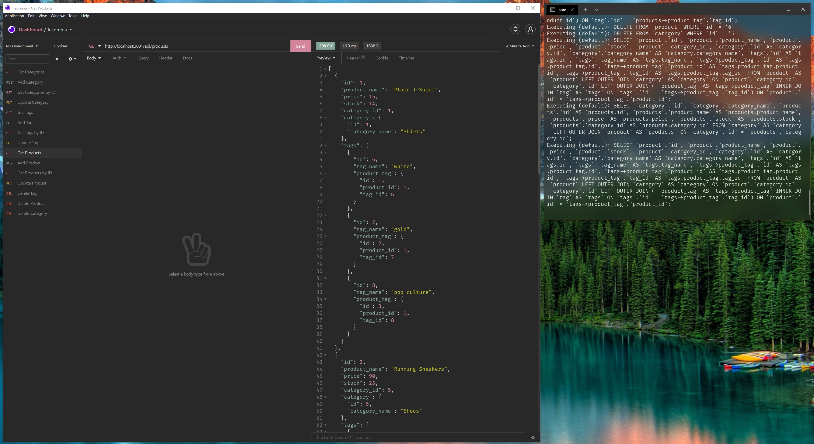

# Grizzly E-Commerce Backend



## Description

Manage a database of products and tags using API calls.

## Table of Contents

- [Installation](#installation)
- [Usage](#usage)
- [License](#license)

## Installation

The easiest way to install Grizzly E-Commerce is to clone this repository using
the following command.

```
git@github.com:bear-evans/ecommerce-backend.git
```

Once downloaded, you can install its dependencies by navigating to the
application's directory and issuing the following command.

```
npm install
```

This will install `express`, `mysql2`, `sequelize`, and `dotenv`.

A database schema and a seed file are included for convenience. To load the
schema, initialize mysql from the command line in the application's directory
and run

```
mysql> source db/schema.sql;
```

To seed the database, use the command

```
npm run seed
```

from the application's root directory.

Additionally, you will need to add a .env file specifying your username,
password, and host for the MySQL connection. A template has been provided.

## Usage

To initiate the application, run

```
node server.js
```

from the app's directory.

A demonstration video of the app's functionality can be found [here](DEMO VIDEO
LINK HERE).

## Tests

There are no tests for the Grizzly E-Commerce Backend application at this time.

## License

Copyright 2021 Bear Evans

Permission is hereby granted, free of charge, to any person obtaining a copy of
this software and associated documentation files (the "Software"), to deal in
the Software without restriction, including without limitation the rights to
use, copy, modify, merge, publish, distribute, sublicense, and/or sell copies of
the Software, and to permit persons to whom the Software is furnished to do so,
subject to the following conditions:

The above copyright notice and this permission notice shall be included in all
copies or substantial portions of the Software.

THE SOFTWARE IS PROVIDED "AS IS", WITHOUT WARRANTY OF ANY KIND, EXPRESS OR
IMPLIED, INCLUDING BUT NOT LIMITED TO THE WARRANTIES OF MERCHANTABILITY, FITNESS
FOR A PARTICULAR PURPOSE AND NONINFRINGEMENT. IN NO EVENT SHALL THE AUTHORS OR
COPYRIGHT HOLDERS BE LIABLE FOR ANY CLAIM, DAMAGES OR OTHER LIABILITY, WHETHER
IN AN ACTION OF CONTRACT, TORT OR OTHERWISE, ARISING FROM, OUT OF OR IN
CONNECTION WITH THE SOFTWARE OR THE USE OR OTHER DEALINGS IN THE SOFTWARE.
